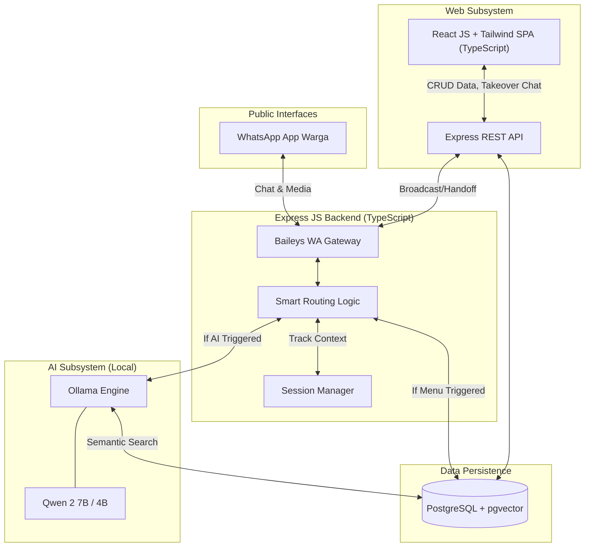
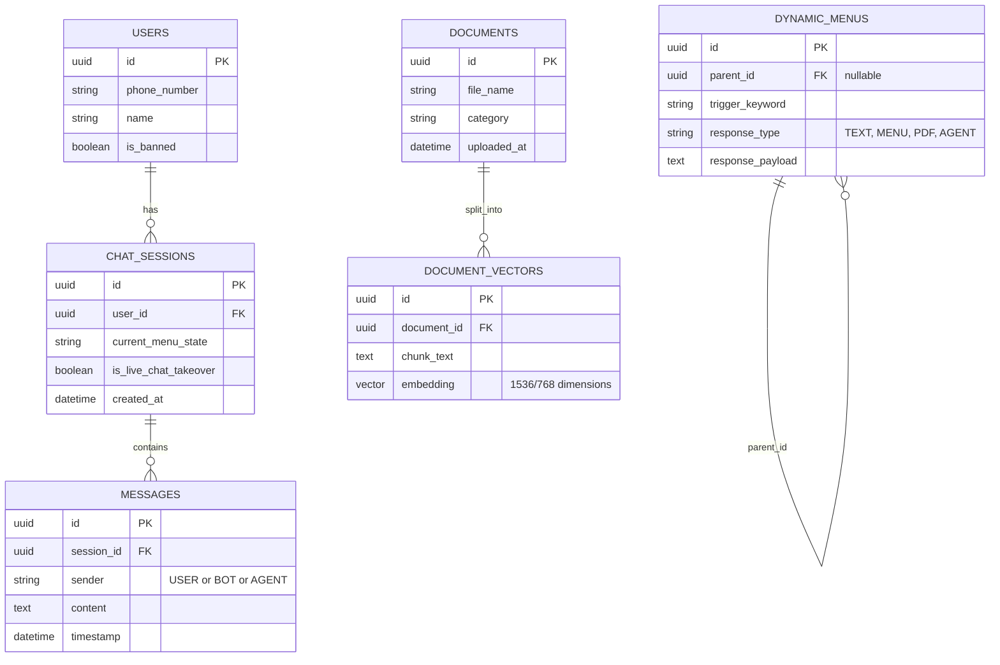
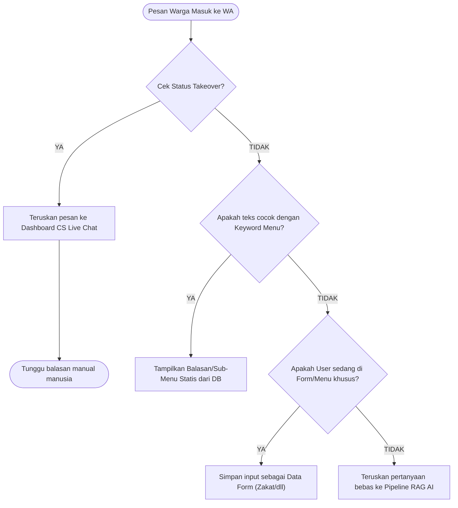

# Dokumen Rancangan Arsitektur Sistem
**Sistem:** Layanan Chatbot WhatsApp Hibrida (Baileys + Qwen 2)
**Klien:** Kementerian Agama Kabupaten Cirebon

---

## 1. Arsitektur Sistem (High-Level Architecture)
Sistem dibangun menggunakan pendekatan modular (*Micro-services architecture* tersederhanakan) yang dipisahkan antara *Core Engine* (WhatsApp & AI) dan *User Interface* (Portal Admin).

## 2. Pilihan Teknologi (Tech Stack)
Keputusan pemilihan *tech stack* didasarkan pada prinsip **Kedaulatan Data**, **Efisiensi Anggaran (Gratis/Open Source)**, dan **Performa**. Seluruh ekosistem dikembangkan menggunakan standar **TypeScript** untuk menjaga keandalan kode (*type-safety*).

1.  **WhatsApp Gateway API**: `Baileys` berjalan di atas `Express JS (TypeScript)` 
    *   *Alasan:* Menghindari biaya langganan bulanan dari WhatsApp Cloud API resmi (Meta). Baileys stabil, mendukung tombol *Interactive*, dan gratis.
2.  **Kecerdasan Buatan (LLM)**: `Qwen 2 (Quantized GGUF)` dijalankan via `Ollama`.
    *   *Alasan:* Qwen 2 memiliki dukungan pemahaman bahasa Indonesia yang luar biasa cerdas dan efisien (bisa berjalan mulus di VPS RAM 16GB CPU tanpa harus menyewa GPU puluhan juta).
3.  **Database & Vektor Engine**: `PostgreSQL` + Ekstensi `pgvector`.
    *   *Alasan:* Mampu menangani penyimpanan data relasional (Sesi Chat, Log Admin, Struktur Menu) sekaligus menyimpan pecahan matriks vektor AI (*Embedding*) di dalam satu *database* yang sama.
4.  **Admin Portal (Frontend)**: `React JS` + `TailwindCSS` (berbasis TypeScript).
    *   *Alasan:* Menghasilkan antarmuka SPA (*Single Page Application*) yang sangat cepat untuk fitur *Live Chat* dan *Menu Builder*.

---

## 3. Desain Basis Data (Entity Relationship)
Struktur ERD (*Entity Relationship Diagram*) yang menjembatani menu dinamis, riwayat percakapan, dan perpustakaan vektor AI.

---

## 4. Alur Logika (Data Flow)

### 4.1. Alur Smart Routing (Penerimaan Pesan Warga)
Saat warga mengirimkan pesan, sistem tidak langsung melemparnya ke AI. Sistem akan melakukan validasi hierarki (*State Machine*).

### 4.2. Pipeline RAG AI (Pembuatan Jawaban Cerdas)
Apabila sistem memutuskan bahwa *chat* warga adalah "Pertanyaan Bebas", *Engine* akan bekerja mencari contekan dokumen.

1.  **Vektorisasi Pertanyaan**: Pertanyaan warga (misal: *"Syarat nikah apa ya?"*) diubah menjadi kode angka (Vektor) oleh modul *Embedding*.
2.  **Semantic Search di PostgreSQL**: Angka tersebut dicocokkan dengan *Database* Vektor. Sistem akan menarik 3-4 paragraf dari buku panduan Kemenag yang paling mirip maknanya (bukan sekadar kemiripan kata).
3.  **Prompt Assembly**: Paragraf contekan tersebut digabungkan ke dalam satu *System Prompt* ketat bersama pertanyaan warga.
    *   *Prompt internal AI:* "Kamu adalah asisten Kemenag. Jawab pertanyaan warga berikut HANYA berlandaskan dokumen ini: [Isi Paragraf Tarikan]. Jika tidak ada di dokumen, tolak menjawab."
4.  **Inferensi Qwen 2**: AI menyusun kalimat jawaban yang sopan dan mengirimkannya ke WhatsApp.

---

## 5. Deployment & Arsitektur Jaringan
Sistem akan di- *hosting* (ditempatkan) secara mandiri di satu mesin (VPS) dengan pembagian *port* yang dibungkus oleh *Reverse Proxy*.

*   **OS**: Ubuntu Server 22.04 LTS / 24.04 LTS.
*   **Web Server**: Nginx (Berfungsi merutekan domain `bot.kemenag.go.id` ke file statis React JS dan merutekan API ke Node/Express).
*   **Keamanan (SSL)**: Let's Encrypt / Certbot (HTTPS).
*   **Process Manager**: PM2 (Untuk menjaga *Backend Express* dan Baileys tetap hidup, *auto-restart* jika *crash*).
*   **Service AI**: Ollama berjalan di *background* pada jaringan tertutup (*localhost*), sehingga tidak bisa diakses/di- *hack* langsung dari internet luar.
